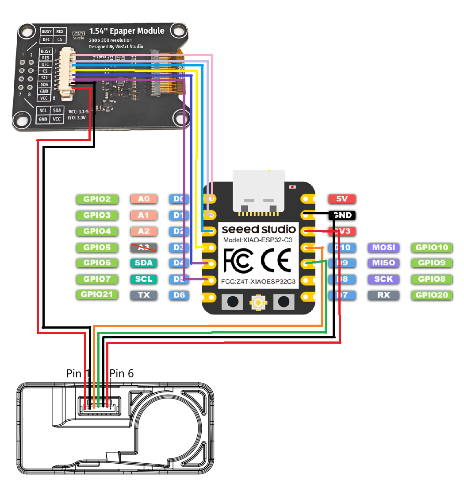

# AQAIO
Air Quality All-In-One

## What is it?
A simple air quality monitor with a e-ink display, built with off the shelf parts

## Bill of Materials
- [SEN66 Sensor PM, RH/T, VOC, NOx and CO2](https://sensirion.com/products/catalog/SEN66)
- [1.54" E-Ink Display Module](https://www.aliexpress.us/item/3256806104827483.html)
- [ESP32-C3 Seeed Studio XIAO](https://www.seeedstudio.com/Seeed-XIAO-ESP32C3-p-5431.html)
- 3D Printed Enclosure ([base](./aqaio-base.stl), [retainer](./aqaio-retainer.stl), [grill](./aqaio-grill.stl))
- M2.5 x 6mm screws

## Wiring
| Function | ESP32-C3 Pin | Component         |
|----------|:------------:|-------------------|
| I2C SDA  |      10      | SEN66             |
| I2C SCL  |       9      | SEN66             |
| SPI MOSI |       7      | EPD (GDEH0154D67) |
| SPI SCLK |       6      | EPD (GDEH0154D67) |
| CS       |       5      | EPD (GDEH0154D67) |
| DC       |       4      | EPD (GDEH0154D67) |
| RST      |       3      | EPD (GDEH0154D67) |
| BUSY     |       2      | EPD (GDEH0154D67) |

